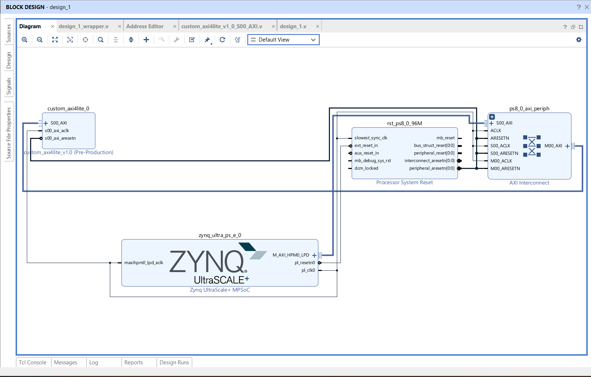

# Custom AXI4-Lite Peripheral

A custom AXI4-Lite peripheral designed and integrated using Vivado.

## Overview

This project implements a custom AXI4-Lite slave peripheral and integrates it into a Vivado block design.

The peripheral provides memory-mapped register access through the AXI4-Lite interface and was verified through simulation.

## Features

- Custom AXI4-Lite slave interface
- Memory-mapped register access
- AXI read and write transactions
- RTL implementation in Verilog HDL
- Vivado block design integration
- Simulation-based verification

## Architecture

The custom peripheral is connected to the AXI infrastructure in the Vivado block design.



## Project Structure

```text
custom-axi4-lite-peripheral/
├── rtl/
│   └── custom_axi4_lite_0.v
│
├── tb/
│   └── custom_axi4_lite_tb.v
│
├── docs/
│   ├── block_diagram.png
│   └── waveforms/
│       └── axi4_lite_simulation.png
│
└── README.md
